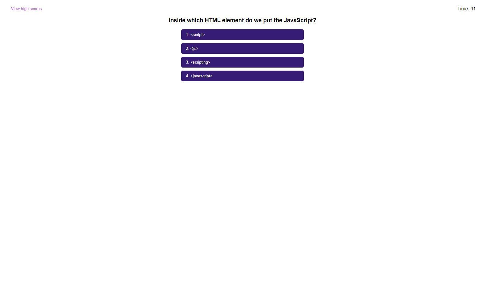

# JavaScript Quiz

## Description
This application is a quiz that tests a user on their JavaScript knowledge. The test taker receives a set amount of time to complete the test and for every question they get wrong it takes 10 seconds off the clock. The quiz is over when all questions have been answered or the time hits 0. Your final score is the time remaining. Scores can be stored in local storage on your computer. This application is useful for gauging your knowledge of JavaScript and can be useful for interview practice.

## Website Screenshot

## Published Website

https://dhoneck.github.io/javascript-quiz/